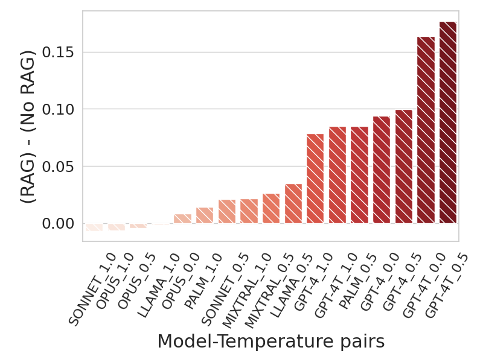
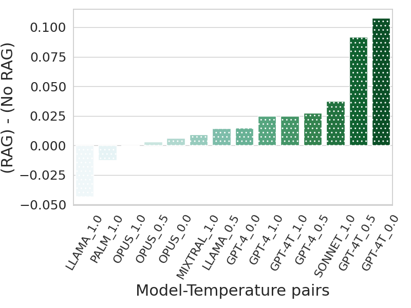
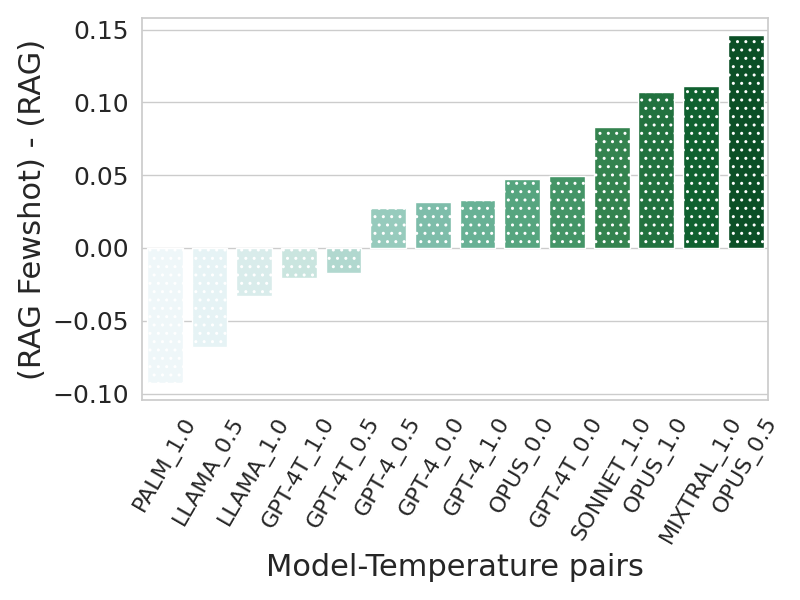
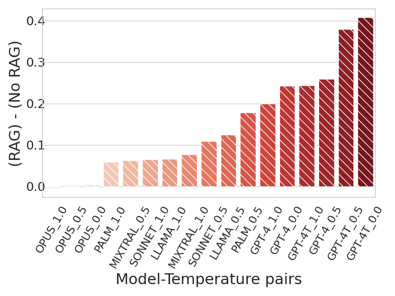
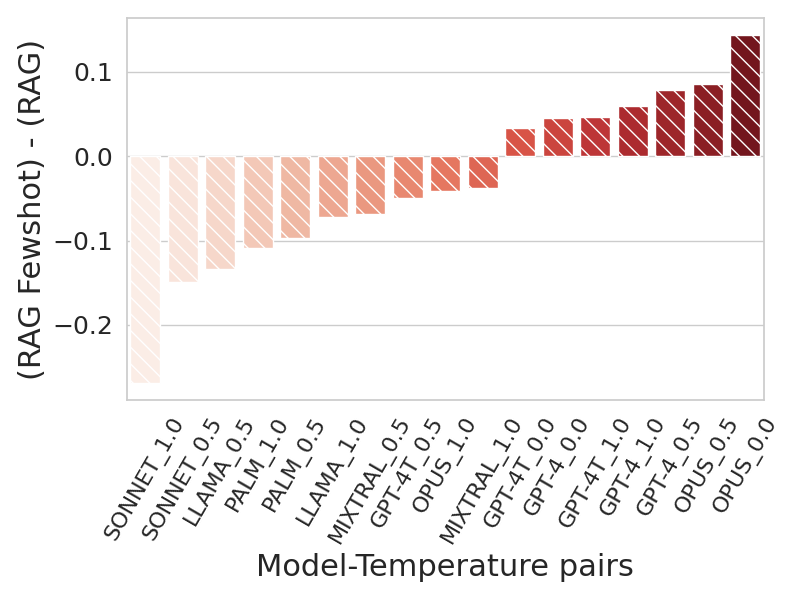
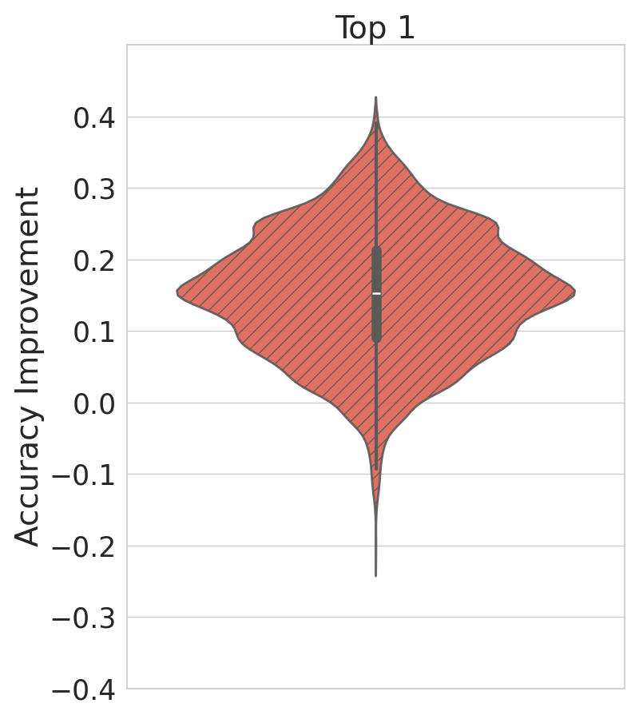
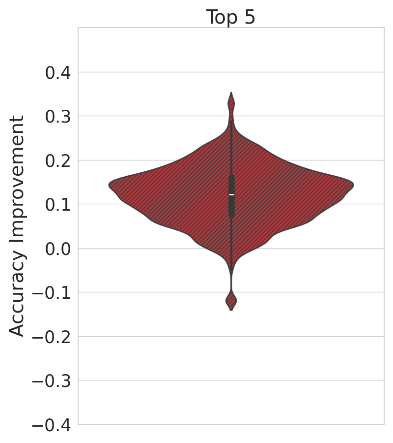
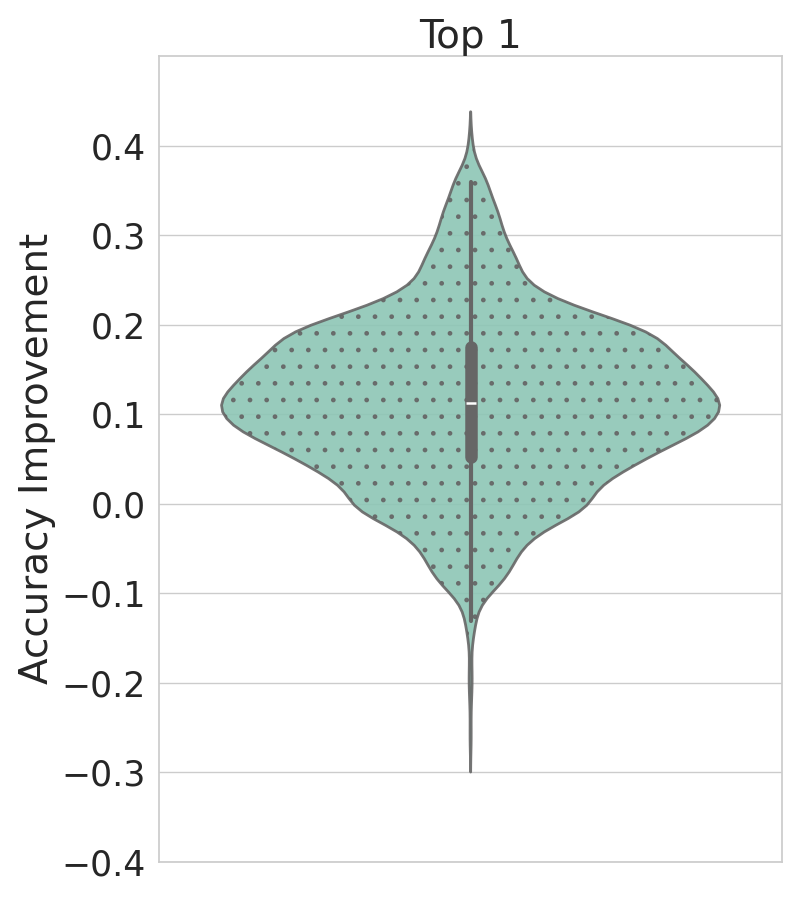
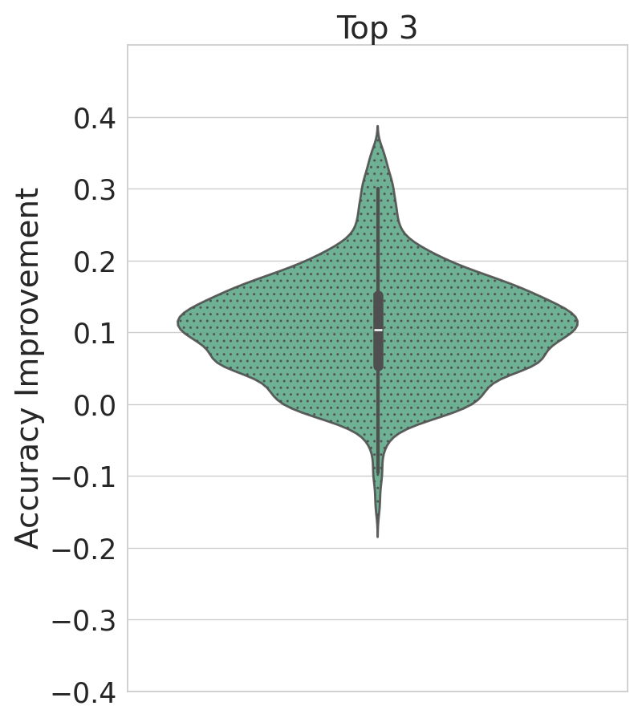
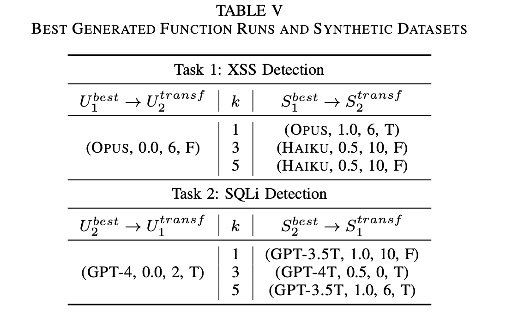

# Results

## Introduction

In our application scenarios (XSS/SQLi detection), we give more weight to false negatives (resulting in low recall) with respect to false positives (resulting in low precision), since a non-detected attack can cause much more damage than a benign request detected as an attack.
For this reason, the main performance metric used in our empirical study is the F2-Score, referred to as F2 for simplicity, which gives double importance to recall than to precision: $F2 = \frac{5 * precision * recall}{4 * precision + recall}$.

To mitigate a possible threat to the construct validity associated with the choice of the performance metric $F2$, which is strongly related to the specific domain of the study, we replicated all experiments using $Accuracy$ as an alternative performance metric.
Accuracy is a valuable choice since the datasets used in this study are well-balanced.

However, to better generalize to a real-world scenario, in which the positive samples are much fewer than the negative ones, we replicated all the experiments also using $F1-Score$ a well-known standard metric that is less sensitive to the balance of the data with respect to the accuracy. Results are consistent and largely independent of the choice of the performance metric.

## RQ1
How helpful is RAG in generating better security attack detectors? How does it perform when combined with Few-shot examples?

### F2-Score [Included in the paper]
The figure below illustrates the impact of RAG on function generation for XSS and SQLi in the NTD (No Training Dataset) scenario, showing the F2 differences between the configurations with and without RAG, across all possible configurations. Each bar represents the average F2 score difference for a specific Model-Temperature pair when using RAG, compared to the same pair without RAG. Results indicate that employing RAG generally enhances the performance of function generation for both tasks. The number of Model-Temperature pairs benefiting from RAG is much larger than the number of pairs showing degradation, and the improvements are statistically significant, as evidenced by p-values ( $\approx 10^{-66}$ for XSS and $\approx 10^{-24}$ for SQLi) below the standard threshold of 0.05. 

<!DOCTYPE html>
<html lang="en">
<body>
    

        

            
            
        

        

            Figure: Difference between the F2 of Generated Function Runs with RAG (i.e., RAG Prompt and RAG-Few-shot Prompt) and the F2 of Generated Function Runs without RAG (i.e., Basic Prompt and Few-shot Prompt), for XSS detection (left) and SQLi detection (right).
        

    

</body>
</html>

---

We further investigate the benefit of combining Few-shot examples with RAG using a similar setting as the figure above. The Figure below shows that while the addition of Few-shot examples shows some benefits for SQLi, the same cannot be said for XSS. These findings suggest that the usage of Few-shot examples may not always provide advantages when RAG is already employed, indicating that in the NTD (No Training Dataset) scenario, it could be preferable to omit them.

<!DOCTYPE html>
<html lang="en">
<body>
    

        

            
            
        

        

            Figure: Difference between the F2 of Generated Function Runs with RAG Few-shot Prompt and the F2 of Generated Function Runs with RAG Zero-shot Prompt, for XSS detection (left) and SQLi detection (right).
        

    

</body>
</html>

### Accuracy [Not included in the paper]

The figure below demonstrates the impact of RAG on function generation for XSS and SQLi in the NTD (No Training Dataset) scenario. It illustrates the differences in accuracy between configurations with and without RAG across all possible configurations. Each bar represents the average accuracy score difference for a specific Model-Temperature pair when using RAG, compared to the same pair without RAG. The results show that using RAG generally improves function generation performance for both tasks. The number of Model-Temperature pairs that benefit from RAG is significantly higher than those that do not, and these improvements are statistically significant, as it is evidenced  by the p-values ( $\approx 10^{-26}$ for XSS and $\approx 10^{-8}$ for SQLi) below the standard threshold of 0.05.

<!DOCTYPE html>
<html lang="en">
<body>
    

        

            
            
        

        

            Figure: Difference between the Accuracy of Generated Function Runs with RAG (i.e., RAG Prompt and RAG-Few-shot Prompt) and the Accuracy of Generated Function Runs without RAG (i.e., Basic Prompt and Few-shot Prompt), for XSS detection (left) and SQLi detection (right). 
        

    

</body>
</html>

---

We further investigate the benefit of combining Few-shot examples with RAG using a similar setting as the figure above. The Figure below shows that the usage of Few-shot examples may not always provide advantages when RAG is already employed. 

<!DOCTYPE html>
<html lang="en">
<body>
    

        

            
            
        

        

            Figure: Difference between the Accuracy of Generated Function Runs with RAG Few-shot Prompt and the Accuracy of Generated Function Runs with RAG Zero-shot Prompt, for XSS detection (left) and SQLi detection (right). 
        

    

</body>
</html>

### F1-Score [Not included in the paper]

The figure below showcases the effect of RAG on function generation for XSS and SQLi in the NTD (No Training Dataset) scenario. It depicts the differences in F1-score between configurations with and without RAG across all possible settings. Each bar represents the average f1-score difference for a specific Model-Temperature pair when using RAG, compared to the same pair without RAG. The findings indicate that incorporating RAG generally enhances function generation performance for both tasks. A significantly higher number of Model-Temperature pairs benefit from RAG than those that do not, and these improvements are statistically significant, as evidenced by the p-values ($\approx 10^{-43}$ for XSS and $\approx 10^{-18}$ for SQLi) being well below the standard threshold of 0.05. 

<!DOCTYPE html>
<html lang="en">
<body>
    

        

            
            
        

        

            Figure: Difference between the F1-Score of Generated Function Runs with RAG (i.e., RAG Prompt and RAG-Few-shot Prompt) and the F1-Score of Generated Function Runs without RAG (i.e., Basic Prompt and Few-shot Prompt), for XSS detection (left) and SQLi detection (right). 
        

    

</body>
</html>

---

Using a setup similar to the previous figure, we further examine the benefits of integrating Few-shot examples with RAG. The figure below illustrates that while adding Few-shot examples offers some advantages for SQLi, the same is not true for XSS. In fact, for XSS, there are more cases where performance degrades than cases where incorporating RAG and Few-shot examples proves beneficial. These results suggest that incorporating Few-shot examples may not always be beneficial when RAG is already in use, indicating that in the NTD (No Training Dataset) scenario, it might be better to exclude them.

<!DOCTYPE html>
<html lang="en">
<body>
    

        

            
            
        

        

            Figure: Difference between the F1-Score of Generated Function Runs with RAG Few-shot Prompt and the F1-Score of Generated Function Runs with RAG Zero-shot Prompt, for XSS detection (left) and SQLi detection (right).
        

    

</body>
</html>

## RQ2
Is the selection of
top_k functions via Self-Ranking an effective strategy to enhance the robustness of LLM-generated detectors?

### Top_k F2-Score [Included in the paper]
 The violin plots shown in the figure below depict the effect of Self-Ranking, i.e., `top_k` selection across three values of $k$ for the two tasks, considering all the possible pairs of function configurations and synthetic dataset generation. Overall, we observe a clear improvement, particularly for XSS. The region between quartiles for XSS falls largely between a 20\%pt and 40\%pt improvement, with an average improvement of 37\%pt and an improvement that affects 98\% of the cases. While the improvement for SQLi is less pronounced, we still observe improvements in 73\% cases, with an average improvement of 6\%pt. Additionally, we can see that, as $k$ increases, the average improvement decreases for both tasks, but the gains become more stable.
The improvements given by the usage of `top_k` selection are statistically significant: the p-values obtained with the Wilcoxon signed-rank test are below the threshold of 0.05 for both the tasks and all the values of k.

In the TDA scenario, we observe that utilizing the Self-Ranking mechanism to select the top\_k functions is more effective than not employing it: when compared to solely using $U^{best}$, employing $S^{best}$ achieves 3.21\%pt and 4.94\%pt increases in F2, for XSS and SQLi respectively.

<!DOCTYPE html>
<html lang="en">
<body>
    

        

            
            
            
        

        

            
            
            
        

        

Figure: F2 given by top_k selection (i.e., Self-Ranking) for XSS detection (first row) and SQLi detection (second row), with k=1, k=3 and k=5.        

    

</body>
</html>

### Top_k accuracy [Not included in the paper]

The violin plots in the figure below illustrate the impact of Self-Ranking, specifically `top_k` selection, across three different values of $k$ for two tasks. This analysis includes all possible pairs of function configurations and synthetic dataset generations.

Overall, we observe a significant improvement, especially for XSS. The interquartile range for XSS predominantly shows an improvement between 10 and 20 percentage points, affecting 98% of the cases with an average improvement of 20%. While the improvement for SQLi is less substantial, 91% of the cases still exhibit enhancements with an average improvement of 15%pt.

The improvements due to `top_k` selection are statistically significant. The p-values from the Wilcoxon signed-rank test are below 0.05 for both tasks across all values of $k$, confirming the reliability of these enhancements.

In the TDA scenario, we observe that utilizing the Self-Ranking mechanism to select the top\_k functions is more effective than not employing it: when compared to solely using $U^{best}$, employing $S^{best}$ achieves 3.37\%pt and 7.29\%pt increases in Accuracy, for XSS and SQLi respectively.

<!DOCTYPE html>
<html lang="en">
<body>
    

        

            
            
            
        

        

            
            
            
        

        

Figure: Accuracy given by top_k selection (i.e., Self-Ranking) for XSS detection (first row) and SQLi detection (second row), with k=1, k=3 and k=5.        

    

</body>
</html>

### Top_k F1-Score [Not included in the paper]

 The violin plots shown in the figure below depict the effect of Self-Ranking, i.e., `top_k` selection across three values of $k$ for the two tasks, considering all the possible pairs of function configurations and synthetic dataset generation. Overall, we observe a clear improvement, particularly for XSS. The region between quartiles for XSS falls largely between a 20\%pt and 40\%pt improvement, with an average improvement of 41\%pt and an improvement that affects 97% of the cases. While the improvement for SQLi is less pronounced, we still observe improvements in 89% cases, with an average improvement of 15\%pt. Additionally, we can see that, as $k$ increases, the average improvement decreases for both tasks, but the gains become more stable.
The improvements given by the usage of `top_k` selection are statistically significant: the p-values obtained with the Wilcoxon signed-rank test are below the threshold of 0.05 for both the tasks and all the values of k.

<!DOCTYPE html>
<html lang="en">
<body>
    

        

            
            
            
        

        

            
            
            
        

        

Figure: F1-Score given by top_k selection (i.e., Self-Ranking) for XSS detection (first row) and SQLi detection (second row), with k=1, k=3 and k=5.        

    

</body>
</html>

## RQ3
Do the detectors generated by LLMs, when assessed on an existing evaluation dataset, demonstrate comparable performance to state-of-the-art ML models trained specifically for the task?

### Comparison with SOTA (F2-Score) [Included in the paper]
To compare ours with learning-based SOTA techniques, we select $U^{best}$ and `top_k` functions based on `val_set` using F2-Score ( $M = F_2$ ). For XSS, $U^{best}$ is $(GPT-4T, 0.0, 10, T)$, while for SQLi, it is $(GPT-4T, 0.0, 2, T)$. We establish a baseline to better understand the improvement offered by adopting our approach. The baseline is obtained using Basic Prompt, without Few-shot examples and RAG.

Table below presents the results of the comparison. We observe a significant improvement of 34\%pt and 18\%pt for XSS and SQLi respectively, when compared to the baseline. 
There is a slight decrease in F2 compared to SOTA models, with a 3.15\%pt and 0.83\%pt drop for XSS and SQLi, respectively. 
We argue that the slight performance gap between our approach and SOTA models is understandable, given our approach's training-free nature and direct applicability to multiple tasks. <!--These results provide empirical support for our claim that incorporating external knowledge and Self-Ranking is essential for LLMs to achieving competitive performance with SOTA models. -->

<!DOCTYPE html>
<html lang="en">
<body>
    

        
    

</body>
</html>

### Comparison with SOTA (Accuracy) [Not included in the paper]
In this section we select the $U^{best}$ and `top_k` functions based on the validation set using the Accuracy ( $M = Accuracy$ ). For XSS, the optimal configuration $U^{best}$ is $(Opus, 0.0, 6, F)$, while for SQLi, it is $(GPT-4, 0.0, 2, T)$. To establish a reference point, we use a baseline derived from the Basic Prompt, which lacks Few-shot examples and Retrieval-Augmented Generation (RAG).

The table below shows the results of our comparison. Our method achieves a substantial improvement of 21%pt for XSS and 18%pt for SQLi when compared to the baseline. However, there is a minor decrease in the Accuracy relative to SOTA models, with a reduction of 0.3 percentage points for XSS and 1.33 percentage points for SQLi. We believe that this small performance gap is justified, considering our method's training-free nature and its direct applicability to various tasks.

<!DOCTYPE html>
<html lang="en">
<body>
    

        
    

</body>
</html>

### Comparison with SOTA (F1-Score) [Not included in the paper]

To compare ours with learning-based SOTA techniques, we select $U^{best}$ and `top_k` functions based on `val_set` using F1-Score ( $M = F_1$ ). For XSS, $U^{best}$ is $(Opus, 0.0, 6, F)$, while for SQLi, it is $(GPT-4T, 0.0, 2, T)$. We establish a baseline to better understand the improvement offered by adopting our approach. The baseline is obtained using Basic Prompt, without Few-shot examples and RAG.

Table below presents the results of the comparison. We observe a significant improvement of 32.8\%pt and 20.2\%pt for XSS and SQLi respectively, when compared to the baseline. 
There is a slight decrease in F2 compared to SOTA models for XSS, with a 1.8\%pt. Instead for SQLi our approach slightly outperforms state-of-the-art SOFIA model. In particular we have an increase of 0.5%pt and 0.2%pt, with $k=1$ and $k=3$ respectively. While with $k=5$ there is only a small performance drop of just 0.2%pt.

<!DOCTYPE html>
<html lang="en">
<body>
    

        
    

</body>
</html>

## RQ4
Can the optimal parameters for function and synthetic data generation in one task be transferred and applied to achieve effective results in other tasks?

### Transferability F2-Score [Included in the paper]
Table below shows the best configuration of each task, specifically for function generation ( $U^{best}$ ) and synthetic dataset generation ( $S^{best}$ ), across different $k$ values with $\mathcal{M} = F_2$. In our notation, Task 1 is XSS and Task 2 is SQLi, and $A \rightarrow B$ represents the transfer of a configuration from one task to another. As an illustration, in $U^{best}_1 \rightarrow U^{transf}_2$, $U^{best}_1$ denotes the best configuration for Task 1, whereas $U^{transf}_2$ represents the transferred configuration, which originates from Task 1 ( $U^{best}_1$ ) and is subsequently  evaluated on Task 2.

<!DOCTYPE html>
<html lang="en">
<body>
    

        
    

</body>
</html>

Table below presents the transferability results. The $F2(U^{best}, S^{best})$ columns indicate F2 computed on the original task with its best configuration, "Avg. F2" columns represent the average F2 computed across all the $U-S$ pairs for a given $k$, and the $F2(U^{transf}, S^{transf})$ columns show F2 computed using transferred configurations. Comparing the transferred configuration's performance to the average column provides a good estimate of the benefits of configuration transfer over a mere random selection of a configuration for a new, unseen task.

The results support the effectiveness of transferring configurations. While there is a slight degradation in F2 compared to the original, best configuration (on average, 3\%pt for XSS and 8\%pt for SQLi ), we can observe those results of transferred configurations outperform the average F2, achieving on average, 16\%pt improvement for XSS and 10\%pt improvement for SQLi.

<!DOCTYPE html>
<html lang="en">
<body>
    

        
    

</body>
</html>

### Transferability Accuracy [Not included in the paper]
The table below highlights the optimal configurations for each task, specifically for function generation ( $U^{best}$ ) and synthetic dataset generation ( $S^{best}$ ), across various $k$ values, with $M = Accuracy$. Here, Task 1 refers to XSS and Task 2 to SQLi, with $A \rightarrow B$ indicating the transfer of a configuration from one task to another. For instance, in $U^{best}_1 \rightarrow U^{transf}_2$, $U^{best}_1$ denotes the optimal configuration for Task 1, while $U^{transf}_2$ represents this configuration transferred and evaluated on Task 2.

<!DOCTYPE html>
<html lang="en">
<body>
    

        
    

</body>
</html>

The table below presents the results of these transferability tests. The $Accuracy(U^{best}, S^{best})$ columns display the Accuracy achieved on the original task with its best configuration. The "Avg. Acc." columns show the average Accuracy across all $U-S$ pairs for a given $k$, and the $Acc(U^{transf}, S^{transf})$ columns demonstrate the Accuracy using transferred configurations. Comparing the performance of transferred configurations to the average column offers insight into the benefits of transferring configurations versus randomly selecting a configuration for a new, unseen task.

The results validate the efficacy of configuration transfer. Although there is a slight decrease in Accuracy compared to the original best configuration (on average, 9.3 percentage points for XSS and 7.8 percentage points for SQLi), the transferred configurations generally surpass the average Accuracy, yielding an average improvement of 4.2 percentage points for XSS and 9.4 percentage points for SQLi.

<!DOCTYPE html>
<html lang="en">
<body>
    

        
    

</body>
</html>

### Transferability F1-Score [Not included in the paper]
Table below shows the best configuration of each task, specifically for function generation ( $U^{best}$ ) and synthetic dataset generation ( $S^{best}$ ), across different $k$ values with $\mathcal{M} = F_2$. In our notation, Task 1 is XSS and Task 2 is SQLi, and $A \rightarrow B$ represents the transfer of a configuration from one task to another. As an illustration, in $U^{best}_1 \rightarrow U^{transf}_2$, $U^{best}_1$ denotes the best configuration for Task 1, whereas $U^{transf}_2$ represents the transferred configuration, which originates from Task 1 ( $U^{best}_1$ ) and is subsequently  evaluated on Task 2.

<!DOCTYPE html>
<html lang="en">
<body>
    

        
    

</body>
</html>

Table below presents the transferability results. The $F1(U^{best}, S^{best})$ columns indicate F1 computed on the original task with its best configuration, "Avg. F1" columns represent the average F1 computed across all the $U-S$ pairs for a given $k$, and the $F1(U^{transf}, S^{transf})$ columns show F1 computed using transferred configurations. Comparing the transferred configuration's performance to the average column provides a good estimate of the benefits of configuration transfer over a mere random selection of a configuration for a new, unseen task.

The results demonstrate the effectiveness of configuration transfer. Although there is a minor drop in F1 scores compared to the original best configuration (on average, 4\%pt for XSS and 7\%pt for SQLi ), the transferred configurations still outperform the average F1. On average, they yield a 14%pt improvement for XSS and a 13%pt improvement for SQLi.

<!DOCTYPE html>
<html lang="en">
<body>
    

        
    

</body>
</html>