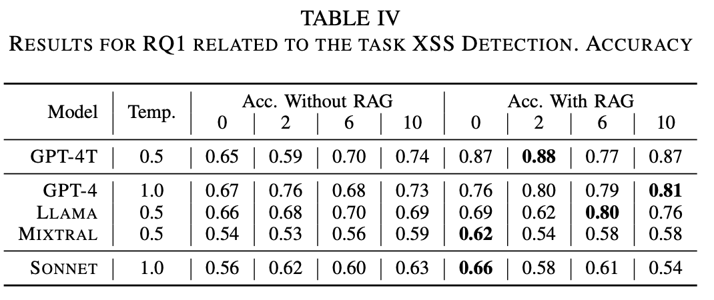
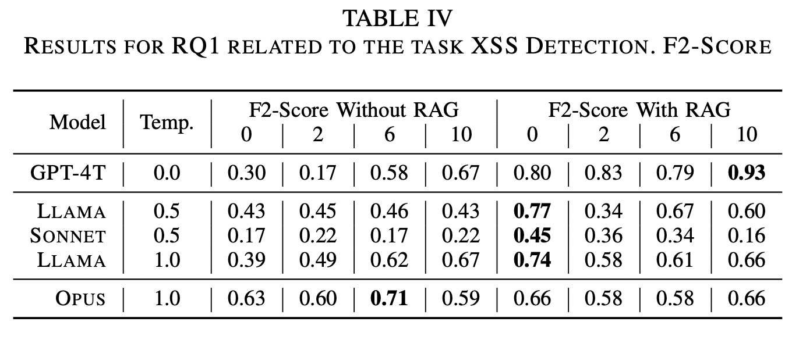
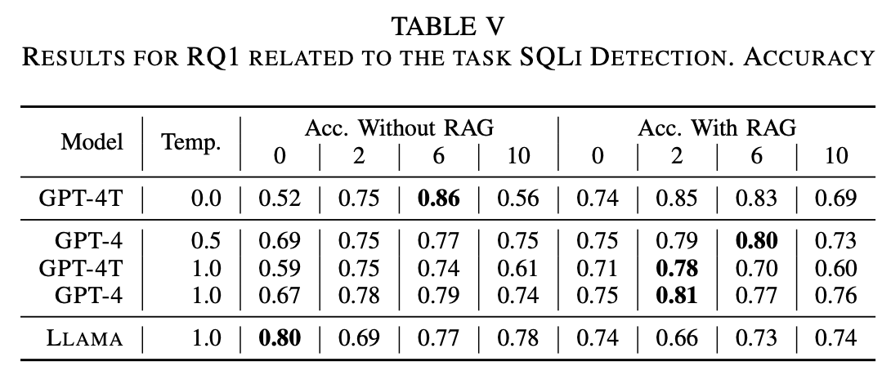
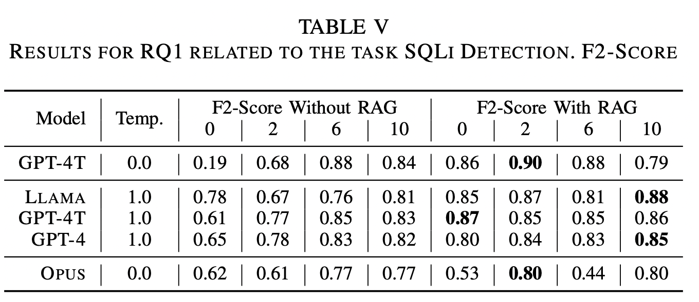
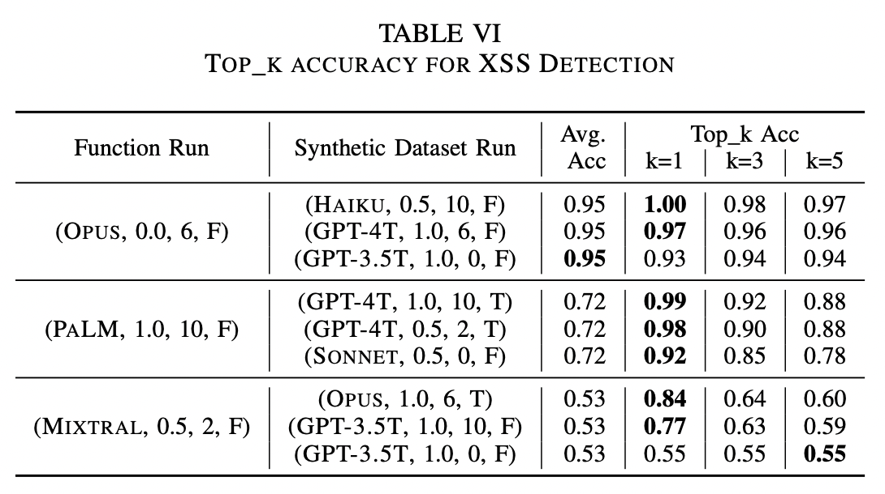
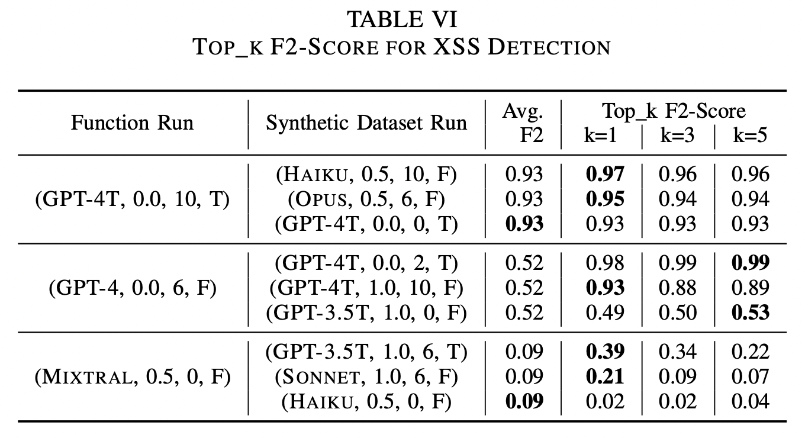
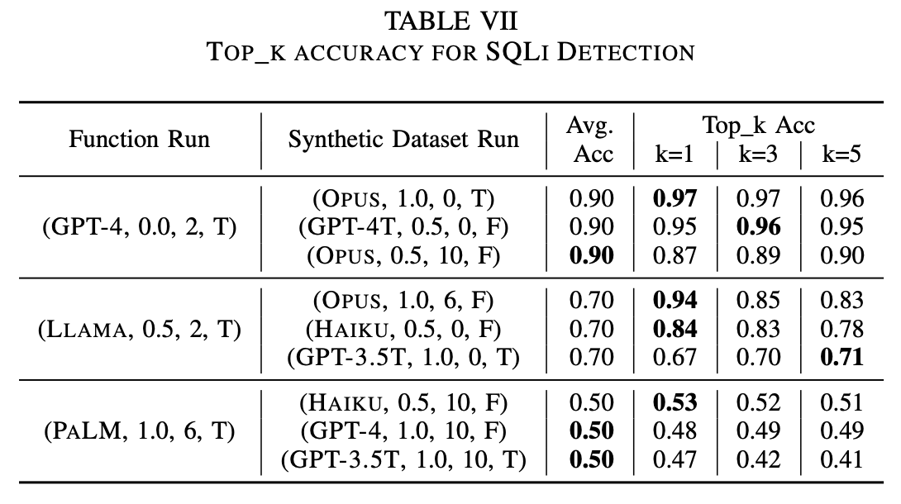
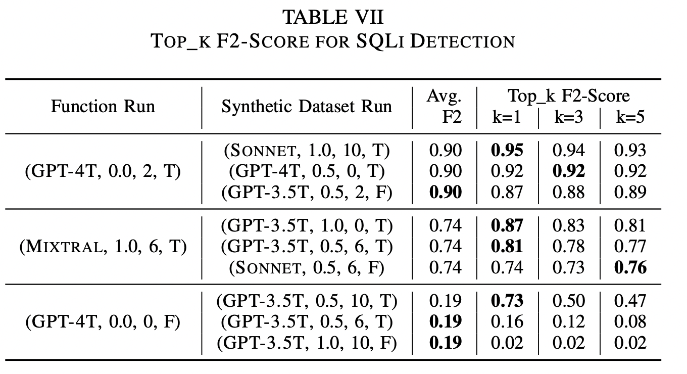
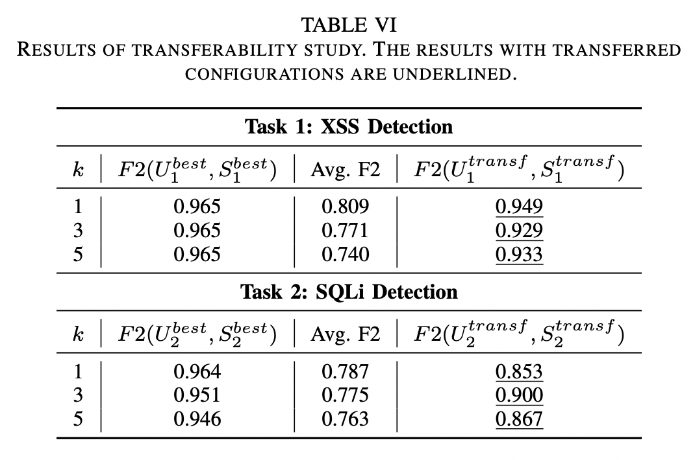

# Results

## RQ1
How helpful is RAG in generating
better security-critical functions? How does it perform
when combined with Few-shot examples?

### Accuracy XSS Detection

### F2-Score XSS Detection

### Accuracy SQLi Detection

### F2-Score SQLi Detection

## RQ2
Is the selection of
top_k functions via Self-Ranking an effective strategy for
enhancing the performance of security-critical functions?

### Top-k Accuracy XSS Detection

### Top-k F2-Score XSS Detection

### Top-k Accuracy SQLi Detection

### Top-k F2-Score SQLi Detection

## RQ3
Do the functions generated by LLMs, when assessed on an existing evaluation
dataset, demonstrate comparable performance to state-of-
the-art ML models trained specifically for the task?

### Compatison with SOTA (Accuracy)

TODO

### Comparison with SOTA (F2-Score)

## RQ4
Can the optimal parameters for
function and synthetic data generation in one task be
transferred and applied to achieve effective results in
other tasks?

### Transferability Accuracy

TODO

### Transferability F2-Score

